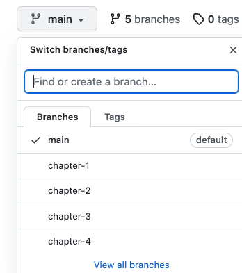
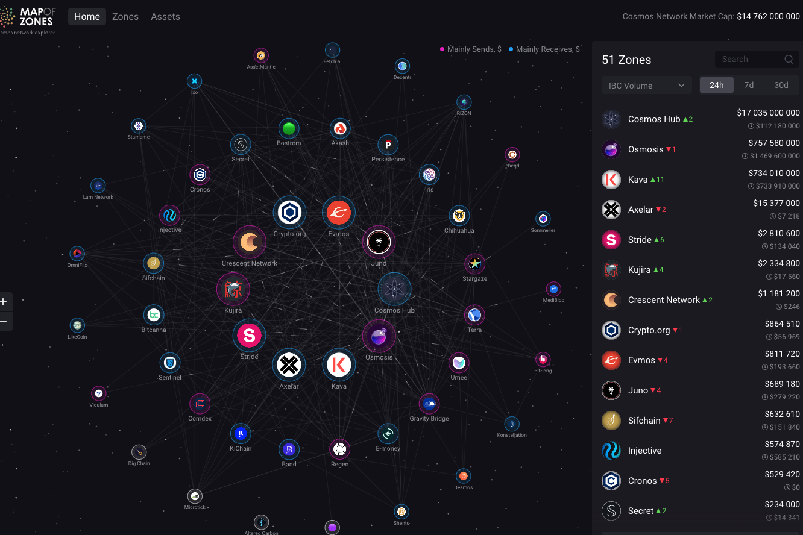

# CosmWasm

### Learn how to build your first Smart Contract:

- ❓ You will learn how to create **CosmWasm** Smart Contracts using Rust programming language!
- 🤘 Using basic tools - **CosmWasm** standard library, and some common utilities.
- 💅 Defining your contract entry points, state management.
- 💥 Write Unit tests.
- 👉 Show you the best practices to make your live easier in the future.
- 😎 You will get Rust knowledge

-------

### How to use this repo:
- Watch the video on your [choice](https://github.com/Ebazhanov/cosmwasm-blockchain-smart-contract#watch-videos-on-vimeo)
- Checkout to the branch to double-check.
- Or look at related [PR's](https://github.com/Ebazhanov/cosmwasm-blockchain-smart-contract/pulls)
- `$ cargo build` and `$ cargo test` or `$ cargo clean`

### Watch videos on [Vimeo](https://vimeo.com/user109497220) (! make sure you are login to Vimeo)  
- Chapter-1 [Introduction](https://vimeo.com/user109497220)
- Chapter-2 [Trivial contracts](https://vimeo.com/731363909)
- Chapter-3 [Queries](https://vimeo.com/731369199)
- Chapter-4 [Contracts testing](https://vimeo.com/731375149)
- Chapter-5 [State management](https://vimeo.com/user109497220)
- Chapter-6 [Execution](https://vimeo.com/user109497220)
- Chapter-7 [Receiving funds](https://vimeo.com/user109497220)
- Chapter-8  [Sending funds](https://vimeo.com/user109497220)
- Chapter-9  [Error handling](https://vimeo.com/user109497220)
- Chapter-10 [Generating Schema](https://vimeo.com/user109497220)
- Chapter-11 [Improving multi tests](https://vimeo.com/user109497220)
- Chapter-12 [Contract as a dependency](https://vimeo.com/user109497220)
- Chapter-13 [Migrations](https://vimeo.com/user109497220)
- Chapter-14 [Version Management](https://vimeo.com/user109497220)
- Chapter-15 [Calling external contracts](https://vimeo.com/user109497220)

-------

### FAQ
- if you block with someone let me know in the Chat below:[/discussions](https://github.com/Ebazhanov/academy.cosmwasm.com/discussions)
- original repo with resources [cw-academy-course](https://github.com/CosmWasm/cw-academy-course)
- what to do next? [Smart contract crash course](https://vimeo.com/user109497220)

### Reference:
- Creator of the course [@Bartłomiej Kuras](https://github.com/hashedone)
- Developer portal
[https://tutorials.cosmos.network/](https://tutorials.cosmos.network/)
- Need better graph look at 
[https://mapofzones.com/](https://mapofzones.com/)

